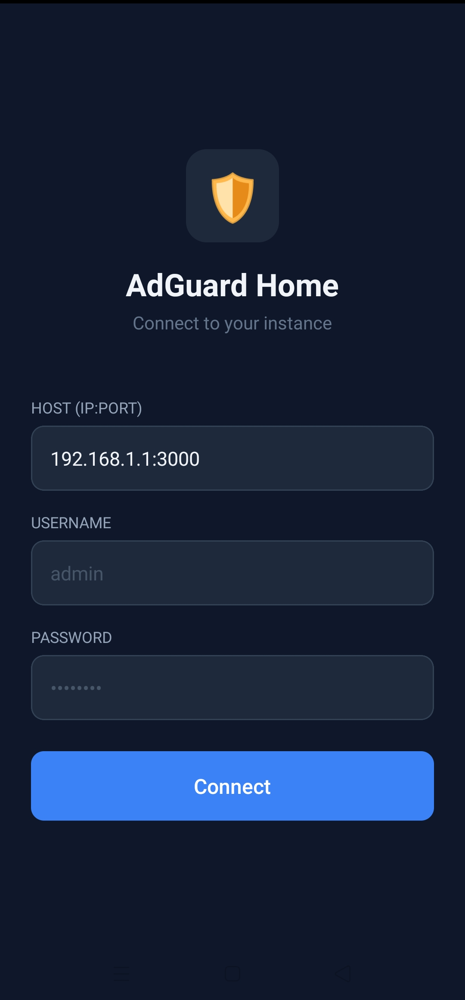
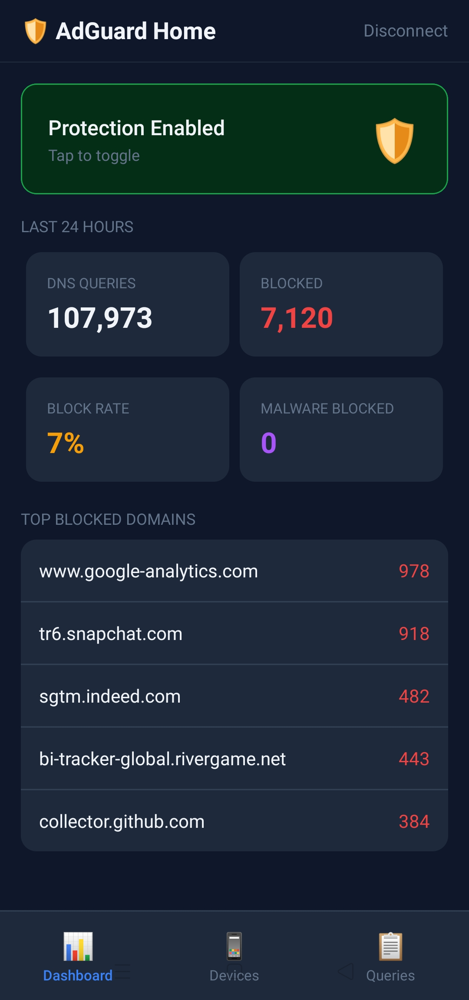
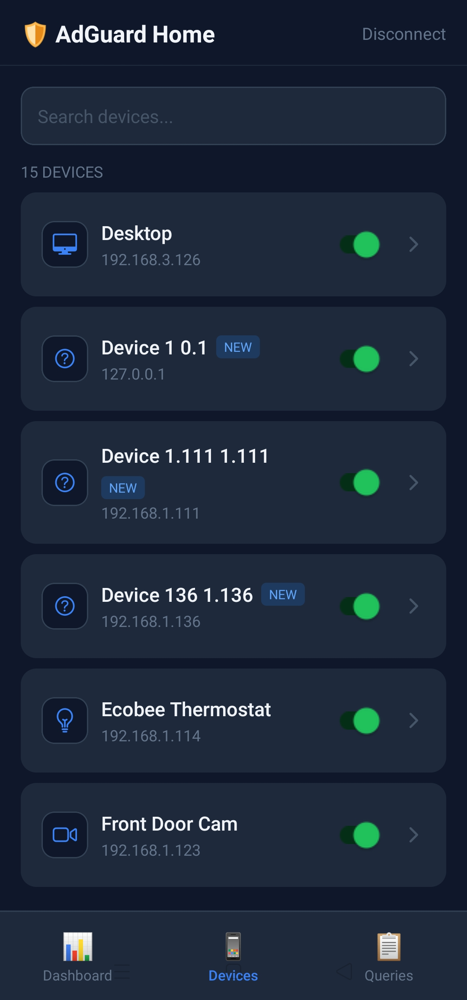
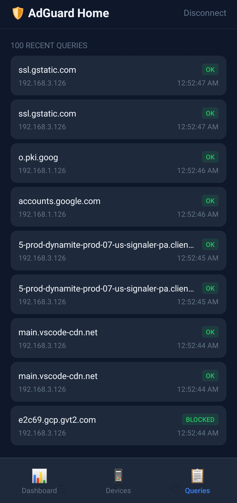

# AdGuard Mobile

A React Native mobile companion app for [AdGuard Home](https://github.com/AdguardTeam/AdGuardHome) — manage your home DNS filter from your phone.

> Works on Android and iOS via [Expo Go](https://expo.dev/go)

---

## Screenshots

<p align="center">
  
  &nbsp;
  
  &nbsp;
  
  &nbsp;
  
</p>
<p align="center">
  <sub>Login &nbsp;·&nbsp; Dashboard &nbsp;·&nbsp; Devices &nbsp;·&nbsp; Query Log</sub>
</p>

---

## Features

- **Dashboard** — live DNS stats (queries, blocked count, block rate, top blocked domains) + one-tap protection toggle
- **Devices** — auto-discovers all devices from query log, smart naming via MAC OUI lookup + DNS domain fingerprinting
- **Block / Unblock** — per-device toggle via AdGuard Home access list API, with optimistic UI update
- **Device Detail** — rename devices, pick device type icon, view IP/MAC identifiers, reset device records
- **Query Log** — color-coded DNS request history (OK / BLOCKED) with client IP and timestamp
- **Secure credentials** — host, username and password stored via `expo-secure-store`, never in plain text

---

## Requirements

- [AdGuard Home](https://github.com/AdguardTeam/AdGuardHome) running on your local network
- [Expo Go](https://expo.dev/go) installed on your Android or iOS device
- Node.js 18+

---

## Getting Started

```bash
# Clone the repo
git clone https://github.com/samagit/adguard-mobile.git
cd adguard-mobile

# Install dependencies
npm install

# Start the dev server
npx expo start
```

Scan the QR code with Expo Go on your phone.

On the login screen enter:
- **Host** — AdGuard Home address and port, e.g. `192.168.1.1:3000`
- **Username** and **Password** — your AdGuard Home credentials

---

## Tech Stack

| | |
|---|---|
| Framework | React Native + Expo |
| Navigation | Expo Router (file-based) |
| Data fetching | TanStack Query |
| State | Zustand |
| HTTP | Axios |
| Storage | expo-secure-store |
| Icons | @expo/vector-icons (Ionicons) |

---

## Project Structure

```
adguard-mobile/
├── app/
│   └── screens/
│       ├── dashboard.tsx
│       ├── devices.tsx
│       ├── login.tsx
│       └── querylog.tsx
├── components/
│   ├── DeviceDetailSheet.tsx   # Bottom sheet: rename, type icon, block toggle
│   └── DeviceRow.tsx           # Device list row with icon + chevron
├── hooks/
│   ├── useClientName.ts        # Syncs custom names to AdGuard persistent clients
│   └── useDeviceType.ts        # Persists device type icon per device
├── services/
│   ├── adguard.ts              # AdGuard Home REST API wrapper
│   ├── clientsApi.ts           # Persistent client CRUD
│   └── deviceDetection.ts      # MAC OUI + domain-based device identification
└── stores/
    └── auth.ts                 # Zustand auth store with SecureStore persistence
```

---

## Device Detection

Devices are identified using two signals:

**1. DNS query patterns** — domain signatures matched against known device fingerprints. Supported brands include Apple, Samsung, LG, Google, Amazon, Microsoft, Sony, Reolink, Hikvision, Canon, TP-Link, Ecobee, Nintendo, Roku and more.

**2. MAC OUI lookup** — vendor identified via [api.macvendors.com](https://macvendors.com) (free, no API key required), then mapped to a device type and icon. Results are cached in memory so each device is only looked up once per session.

Detection is intentionally conservative — ambiguous domain signatures require multiple matches to avoid false positives (e.g. the Amazon Echo / Alexa false positive that `bob.amazon.com` causes).

---

## AdGuard Home API

Uses the AdGuard Home REST API (`/control/*`):

| Endpoint | Usage |
|---|---|
| `GET /control/stats` | Dashboard stats |
| `GET /control/querylog` | Query log + device discovery |
| `GET /control/clients` | Persistent client list |
| `POST /control/clients/add` | Register new device |
| `POST /control/clients/update` | Rename device |
| `POST /control/clients/delete` | Remove device record |
| `GET /control/access/list` | Blocked clients list |
| `POST /control/access/set` | Block / unblock device |
| `POST /control/dns_config` | Toggle DNS protection |

---

## License

GPL v3 — see [LICENSE](LICENSE)

You are free to use, modify, and distribute this software under the terms of GPL v3. Any derivative work must also be released under GPL v3.

---

## Contributing

Issues and PRs welcome. If a device on your network isn't detected correctly, open an issue with the domain patterns from your AdGuard query log and I'll add a signature.

---

## Roadmap

- [ ] Play Store release
- [ ] Dashboard screen for the device detail (per-device query log)
- [ ] DHCP lease integration for MAC-based detection during discovery
- [ ] Multiple AdGuard Home instance support
- [ ] Dark / light theme toggle

---

*Built for homelab enthusiasts who want mobile control of their network.*
